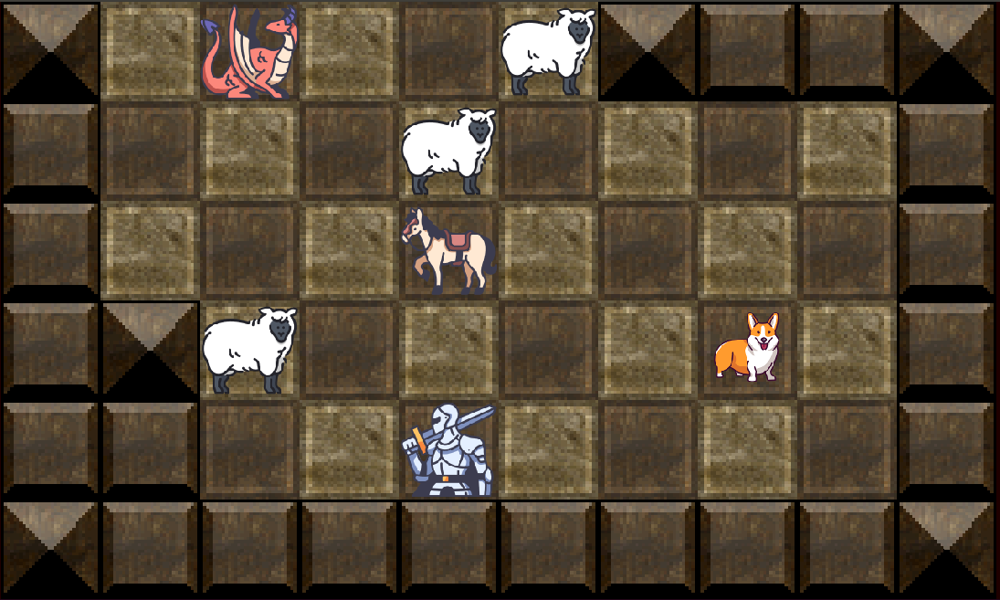

# Don't Eat My Sheep!

## Motivation

Someone wanted to c me write a program in C. So here's a puzzle game written in C99.

## How2play

The dragon wants to eat up all the livestock so the knight wants to slay the dragon before that can
happen. Click on a piece, then click a square next to the piece to make a move. Pieces only move 1
square at a time and not diagonally. In order for the knight to slay the dragon, he must first be
moved onto the same square as his horse in order to mount the horse. Then he can slay the dragon by
moving onto the same square as the dragon.

Press R to restart if you fail the puzzle. Press Escape to quit the app.

## Installation: Ubuntu

This app requires some packages installed:

    apt-get install libsdl2-dev libsdl2-image-dev

## Usage

Compile and run:

    ./start.sh

Run unit tests:

    ./start.sh test

## Credits

Terrain:
* Screaming Brain Studios: https://screamingbrainstudios.com/

Characters:
* Triberion and max.icons from Flaticon: https://www.flaticon.com/

Cooldown Icon:
* Roundicons from Flaticon: https://www.flaticon.com/
